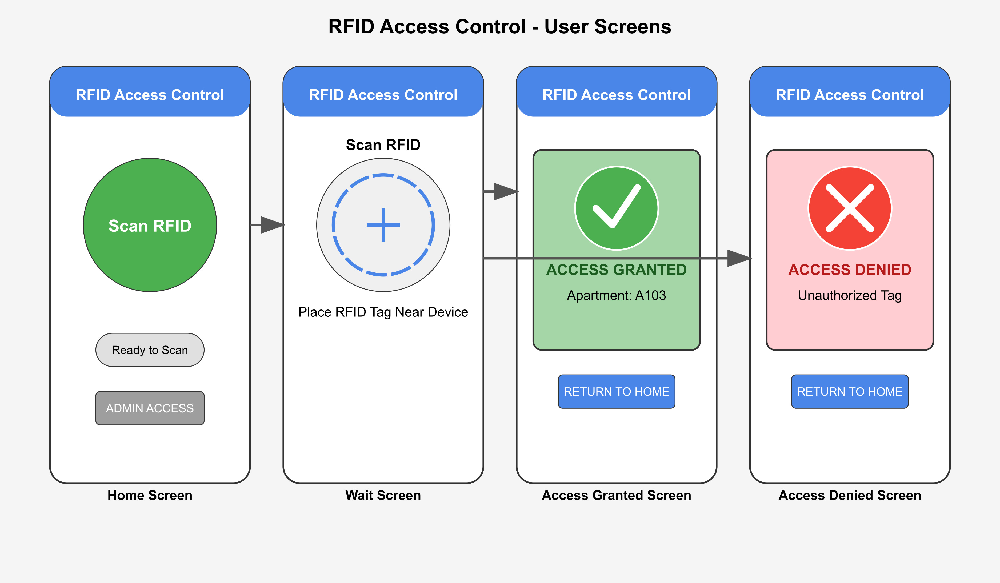
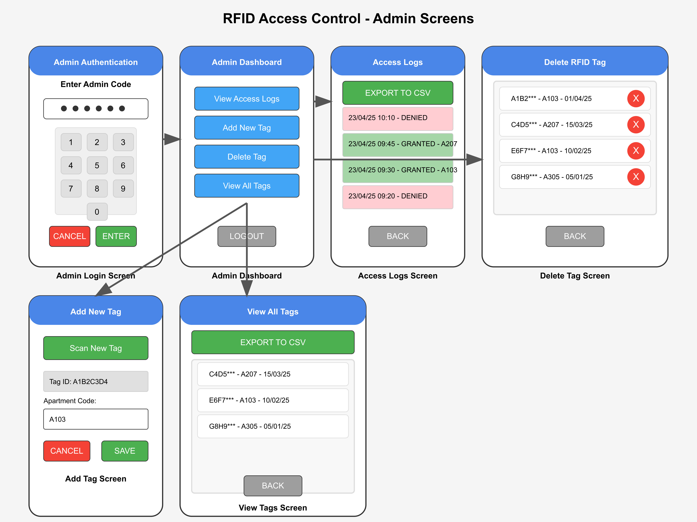

# RFID Access Control System - User Guide

A quick guide to using the RFID Access Control System for building access.

## Scanning for User Access

1. Tap the "Scan RFID" button.
2. Hold your RFID card/tag at the back of the device
3. Wait for the result screen:
  - **Green screen with checkmark**: Access granted
  - **Red screen with X**: Access denied

## For Admins.

- Admin access: Tap "ADMIN ACCESS" button and enter the current TOTP code
- Admin functions:
 - View access logs of all entry attempts
 - Add new RFID tags for residents
 - Delete tags that should no longer have access
 - View all authorized tags
 - Export logs and tag data to CSV files

## Troubleshooting

- Tag not reading: Hold closer to device back
- Device unresponsive: Check power and that app is running
- Blank screen: Tap once to wake